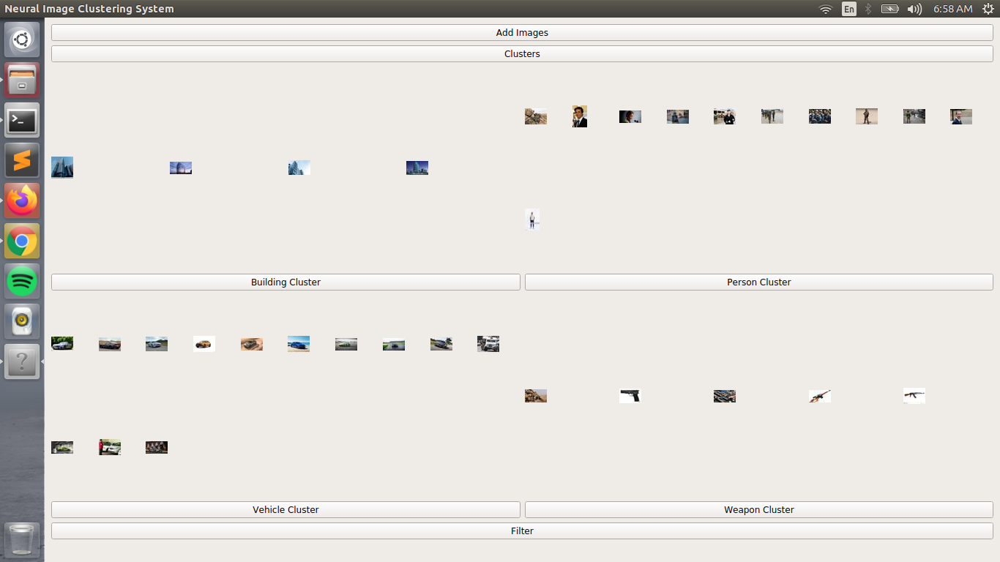

# neural-image-clustering-system
It takes images as input and then assigns them to a cluster based on the probability of each class in an image(extracted using a softmax layer at the end of network). For this an ensemble model of 3 ResNet50s(trained myself) is deployed at backend instead of a single ResNet because at the time of testing it was missing out on some objects in images when they were closer than a particular distance. It was providing lower than expected probabilities for such targets. So, I created an ensemble model in which each ResNet is trained to handle specific part which helped me acheive good results.

Here I've tried a new supervised way for clustering which is faster and in some cases more accurate than K-means because of the use of a trained model at backend. But as of now this project only works for 4 classes namely building, person, weapon and vehicle.

The only downside of supervised clustering is that you have to have a trained model(which will later be used for clustering) prior to the whole clustering process, whereas in K-means training happens on the fly i.e. the model stars with zero experience and learns from the images in real-time while clustering them one by one, eventually getting better. I'm working to overcome that downside of supervised clustering, so that even a few images would be sufficient for the model to learn the pattern thoroughly.

## Requirements:
1. PyQt5 (comes pre-installed in Ubuntu)
2. PyTorch 1.1+

## Prerequisites:
1. Create a folder named 'add_new' under ./clustering_sys code
2. Create a folder named 'ensemble_model' under ./clustering_sys code/dl_models
3. Create two folders 'level1' and 'level2' under ./clustering_sys code/dl_models/ensemble_model
4. Download the .pth(trained model) files from the link provided and place them in their respective folders:
   1. level1:
   - https://drive.google.com/open?id=1mo1jPRIjFLGWKc89ptShU4juakd5i2-1
   - https://drive.google.com/open?id=1aNr-PApeLLahk47mKnDLOGC1QJAOxMR3
   2. level2:
   - https://drive.google.com/open?id=1dB-6amHZ1ceb21_X-MbOTyerH5xJ2b5s
5. Check out the addresses of files provided in code in files under ./clustering_sys ui and change them according to your environment.
6. If you are using PyTorch GPU, please read the comments provided in impl.py located under ./clustering_sys ui

## How to use:
1. Open a terminal at ./clustering_sys ui
2. Activate the environment in which PyTorch is installed. (Skip this if you've PyTorch installed on base)
3. Compile and execute 'impl.py' using, $ python impl.py

## Explaination for various buttons on the main window is given below,

  

The images that can be seen are already clustered images, that I've added to the database of the clustering system.

### Add Images: 
The clustering system has its own database in which it maintains all the images that are present into clusters. This button is used to add new images to the database of clustering system.

### Clusters:
This button classifies the images and assigns them to one of the clusters with the help of probability of each class extracted from a given input image. Probabilty of occurence of a class in an image can be extracted by using a softmax layer at the end of a NN. It cannot be used without adding new images and will throw an error. So, to use this button images must be added at first using ‘Add Images’ button. The results of the previous images in the database are stored and dont need to be re-evaluated.

### Building Cluster/ Person Cluster/ Vehicle Cluster/ Weapon Cluster:
Clicking one of these buttons will open a new window with a zoomed in view of all the images present in that particular cluster. The images can be enlarged by clicking on them.

### Filter:
This button is used to filter out the images that are present in the database. There are 3 sliders from which only one can be used at a time. The position of slider represents the probability of occurence of either class present at two ends i.e if the slider is in the middle then those images will be displayed in which both classes have a 50/50 chance of occurence. And if the slider is pushed all the way to right then those images will be displayed in which 1st class(on the left of slider bar) has probability as 1.
